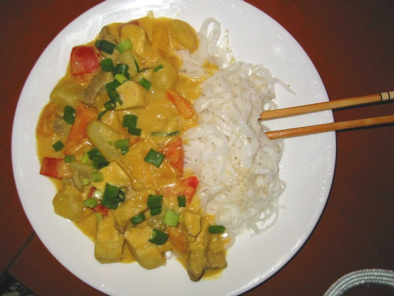
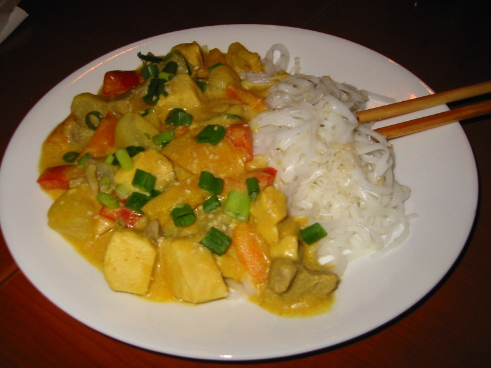

Double Meat Red Curry 
--------------------------

    1 Tbsp sesame oil
    .5 lb of beef strips (cubed)
    .5 lb of chicken breast (cubed)
    2 medium sized potatoes (cubed)
    1/2 yellow pepper (cut 1"x.5")
    1/2 red pepper (cut 1"x.5")
    1/2 oragne pepper (cut 1"x.5")
    1 can of coconut milk
    .5 Tbsp. turmeric
    1.5 Tbsp red curry paste
    1/2 cup milk
    1 Tbsp corn starch
    1/2 Tbsp onion powder
    Rice Noodles
    Lime Juice
    Scallions
    Sesame seeds

Total cooking time: 45 minutes

1. Boil potatoes until tender on the outside, strain when done
2. Simmer coconut milk, sesame oil, turmeric, curry paste in wok
3. Add beef and chicken to wok and simmer until beef is grey and chicken is white
4. Mix milk and cornstarch in measuring cup and stir until mixture is smooth with no chunks.
5. Add red/yellow/orange peppers, potatoes, onion powder, and corn starch mixture to wok.
6. Boil enough water to cook rice noodles, when done boiling, remove from heat and add rice noodles
   wait for them to get soft. Strain when done and rinse with cool water.
7. Fill plate 3/4 with rice noodles, and 1/2 with mixture from wok.
8. Garnish with scallions on the mixture side, and sesame seeds on the rice side. Flavor with a splash of lime juice

Makes 4 servings.

