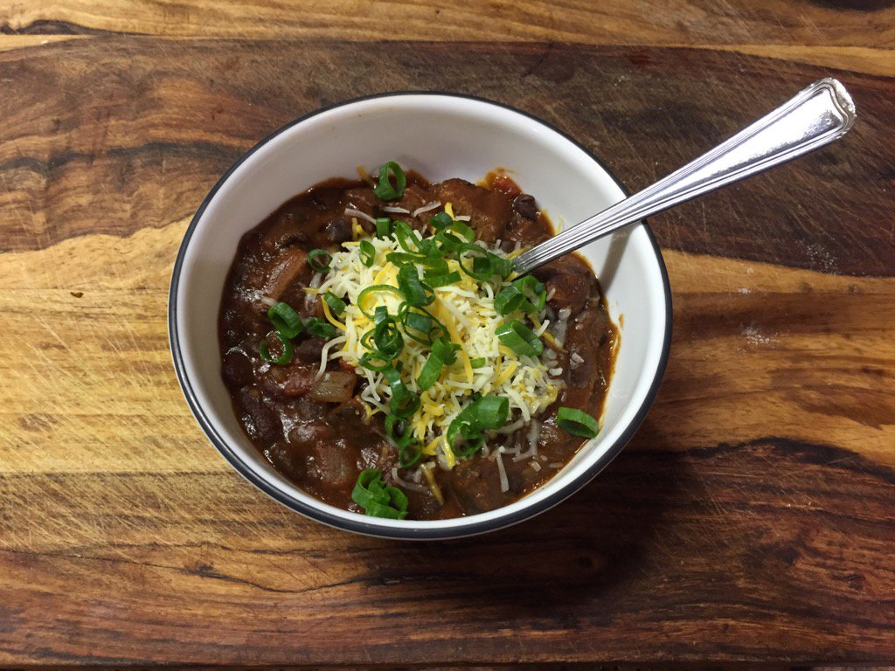

Smoked Brisket Chili
====================

Smoker:

    1.5 lbs beef brisket
    1/4 cup maple syrup
    1/4 cup apple cider vinegar

Base:

    1 can kidney beans (14.5oz)
    1 can black beans (14.5oz)
    1 can diced tomato (14.5oz)
    1 can tomato paste (6oz)
    2 cloves finely diced garlic
    2 Tbsp fresh chopped cilantro
    1 cup diced white onion
    1/2 cup diced pasilla pepper
    1/4 cup maple syrup

Spices:

    1 Tbsp cumin
    1 Tbsp chili powder
    1 Tbsp chipotle powder
    2 tsp salt
    1 tsp paprika

Finishing:

    2 Tbsp masa flour
    1 Tbsp olive oil

Directions
----------

Smoker:
1. Put the brisket, fat side up in the smoker.
2. Load the smoker up with hickory chips
3. Put the 1/4 cup of maple syrup and the 1/4 cup of cider vinegar in a spray bottle.
4. Set the smoker up at 225F, and let it go for 6 hours, until you reach 195F internal temperature. Spray the beef with the mixture every 30 minutes, replace chips every 2 hours.
5. Remove beef when cooked, and remove fat layer with a knife.

Base:
1. Mix all base ingredients in crockpot.
2. Cube the beef brisket and add it to the crockpot, and stir well to mix thoroughly.
3. Put the crockpot on high for 3 hours, stirring every 30 minutes.

Finishing:
1. Turn off the crockpot.
2. Add masa flour and olive oil and stir well to blend. 
3. Let cool a bit before serving with shredded cheese and garnish with scallions or chives.

