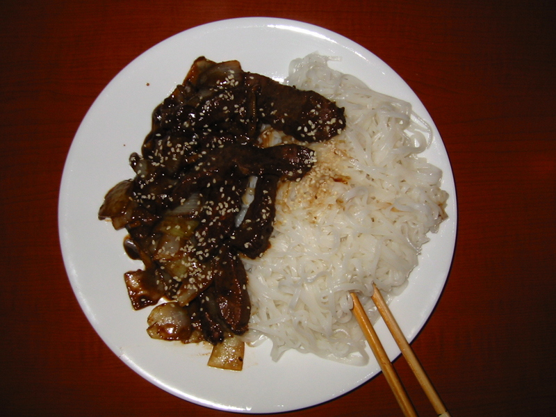
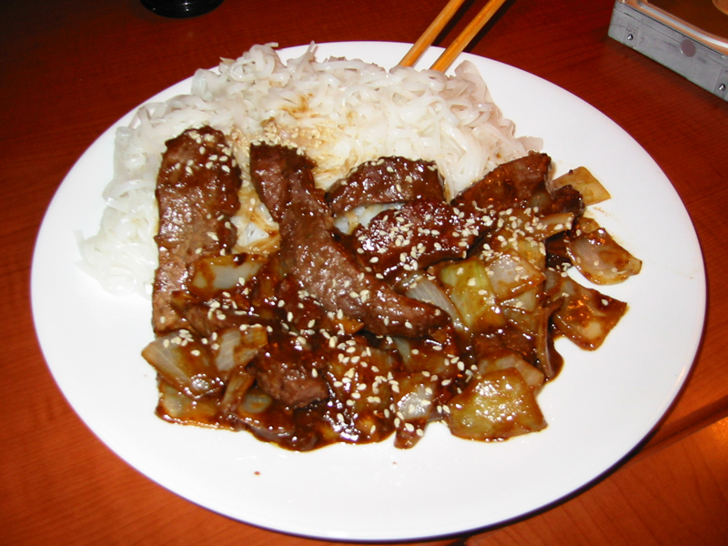

Tangy Peanut Beef
-----------------

1 Tbsp sesame oil
1/3 medium onion
1 garlic clove
.5 lb of beef strips 
1/4 tsp Coriander
1/4 tsp anise seed
Pinch of salt
Pinch of black pepper
1/4 cup peanut sauce
1/4 cup mirin
1 Tbsp pure maple syrup
1/4 tsp garlic power
1/4 tsp onion powder

Rice Noodles
Lime Juice
Sesame seeds

Total cooking time: 15 minutes

1. Prepare rice noodles, and toss them with lime juice
2. Heat sesame oil on med-hi in frying pan or wok.
3. Prepare sauce of: peanut sauce, mirin, anise seed, coriander, garlic powder, onion powder, maple syrup 
4. Slice onion into bite-sized wedges. Dice garlic clove.
5. Cook beef in sesame oil until outside is slightly brown/grey
6. Pour sauce over beef, stir well, and let simmer until sauce is thick, stirring occasionally.
7. When sauce is thick, put onions and garlic into the pan. Let simmer until onions are soft.
8. Top rice noodles with mixture from wok and garnish with sesame seeds and lime juice.

Makes 1-2 servings

